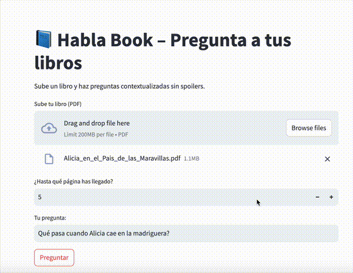
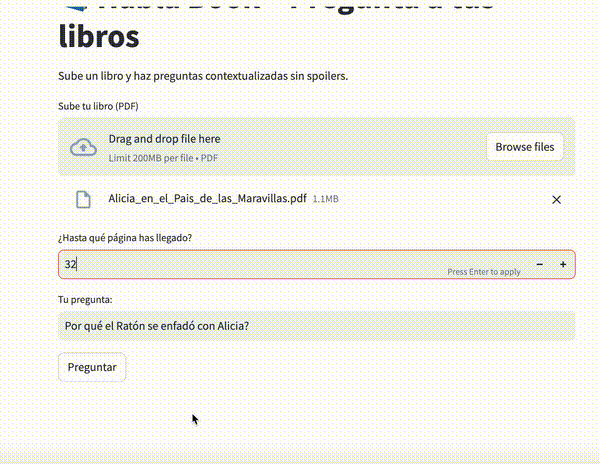
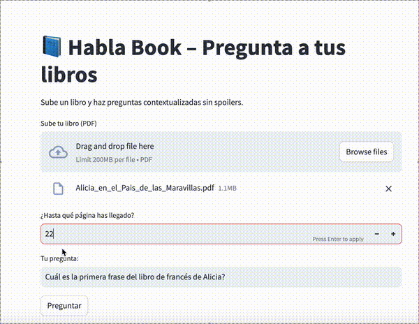

# 📚 Habla Book

Asistente lector inteligente.  
Diseñado para acompañar al lector durante el proceso de lectura de obras narrativas, resolviendo dudas sobre personajes, lugares o eventos sin arruinar la experiencia.

---

## 🧠 ¿Qué hace?

Habla Book permite al lector realizar preguntas como:

- **¿Quién es este personaje?**
- **¿Dónde ocurrió tal cosa?**
- **¿Qué pasó exactamente en ese capítulo?**

Y responde de forma clara, contextualizada y sin adelantar información aún no leída.

---

## ✨ Características clave

- 🧭 **Acompañamiento lector** no intrusivo
- 📖 Compatible con novelas y obras narrativas extensas
- 🤖 Basado en técnicas de procesamiento de lenguaje natural e IA Generativa
- 🚫 Sin spoilers: filtra automáticamente contenido no leído
- 🧩 Indexación semántica contextual
- 🛠️ Pensado para jóvenes lectores, adultos, y uso educativo

---

## 🎬 Demostración

### 🗺️ Evitar spoilers

### 🐇 Preguntas sobre personajes

### 🔍 Otras consultas

---

## Cómo probar

La aplicación está disponible públicamente en el siguiente enlace:

👉 [**hablabook.streamlit.io**](https://hablabook.streamlit.io)

Sin necesidad de instalación ni registro. Solo sube tu libro y empieza a preguntar.

*(Necesaria API Key de Open AI para el uso del sistema. Pueden aplicarse cargos por uso.)*

---
Referencias

- [Nubeteca](https://www.dip-badajoz.es/cultura/ceex/index.php?cont=nubeteca), promovido por la Diputación de Badajoz y la Universidad de Salamanca.
- Muñoz Rico, M., & Cordón Muñoz, M. (2023). *Tendencias y perspectivas de la investigación sobre «Inteligencia Artificial en la educación»*. En *Tecnologías emergentes aplicadas a las metodologías activas en la era de la inteligencia artificial* (pp. 1085–1103). Dykinson.